# **A* Algorithm**
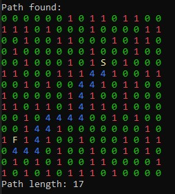

Course: Bachelor of Engineering (Honours) in Software and Electronic Engineering

Module: C++ Programming

# **Introduction**

Welcome to my C++ A* search algorithm project. My name is Pero Schwitalla and this is my project blog where I document the process of creating the A* Algorithm, why I made the design choices I made and my thoughts on how the project went.

# What Is The A Star Algorithm
The A* (AStar) algorithm is a widely use pathfinding algorithm. Its widely use in GPS navigation, video games and robotics. It is similar to Dijkstra's algorithm with the key difference being that A* uses a heuristic to estimate the distance to the destination. This allows the A* algorithm to efficiently find the shortest path in most cases. 

## How A* works

The **A* search algorithm** finds the shortest path by combining:

- the **actual cost so far**
- an **estimate of the remaining distance**

It evaluates each possible step using this formula:

f(n) = g(n) + h(n)

- **g(n)** = cost from the start node to node _n_
- **h(n)** = heuristic (estimated cost from _n_ to the goal)
- **f(n)** = total estimated cost of a path through _n_

The **A* search algorithm** begins by placing the starting node into a set of nodes to be explored, called the open list, and assigning it a cost of zero for the distance travelled so far, written as g(n) = 0. From there, the algorithm repeatedly selects the node in this open list with the lowest estimated total cost, f(n), which represents the most promising path at that moment.

Once a node is selected, the algorithm checks whether it is the goal. If it is, the search stops because the shortest path has been found. If it is not the goal, the algorithm looks at all of its neighbouring nodes. For each neighbour, it calculates the actual cost to reach it from the start (g(n)), estimates the remaining distance to the goal using a heuristic (h(n)), and combines these into the total estimated cost f(n).

If the algorithm discovers a better path to a neighbour than any previously known path, it updates that node's cost values and records the current node as its predecessor so the final path can be reconstructed later. After processing all neighbours, the current node is moved from the open list to a closed list, which keeps track of nodes that have already been fully explored.

This process continues, always choosing the node with the lowest estimated total cost, until the goal node is reached or there are no more nodes left to explore, in which case no path exists.

# Creating The A* Algorithm
## Research and Initial Code
I started by researching the A* algorithm. I looked at a GeeksforGeeks article [1] which gave a detailed explanation of how it works and also gave some example C style code. I copied the code and ran it so I begin to better understand how it works. 

The code used a hardcoded grid. 0's represent walkable areas, 1's represent obstacles. The start and destination are also hard coded.
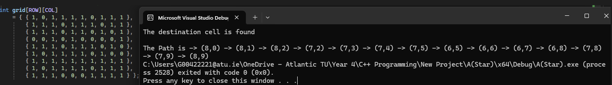

This is an example of the notes I took during my research. I wanted to understand the core logic of the A* algorithm at a high level.
I learned how G, H and F are used to keep track of the path length and the cost of movement.

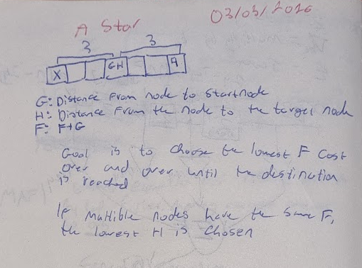

## Heuristics
### What are heuristics
The GeeksforGeeks code uses Euclidian distance. This is simply the straight line distance between the starting point and the destination. It is used when movement in any direction is allowed.
The formula for *Euclidian Distance* is:

$d = \sqrt{(x_2 - x_1)^2 + (y_2 - y_1)^2}$

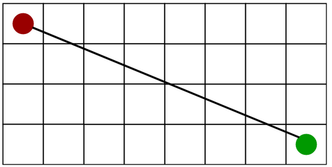

[1] Euclidian Distance Diagram

There are 2 other common heuristics:

*Manhattan Distance*:
Manhattan distance is the sum of the absolute values of the differences in the goals x and y co-ordinates. It is used when movement in only 2 directions is allowed.

The formula for Manhattan distance is: $$
d = |x_1 - x_2| + |y_1 - y_2|
$$

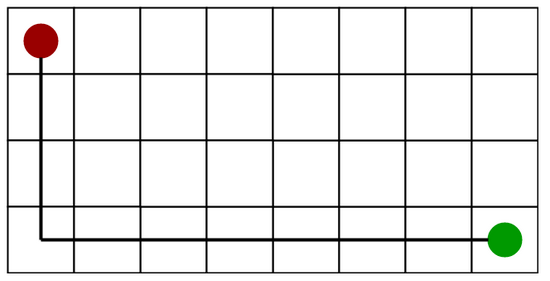

[1] Manhattan Distance Diagram

*Diagonal Distance*:
Diagonal distance is the maximum value of differences between the goal and destination x and y coordinates. Its is used when movement in 8 directions is allowed.

The formula for Manhattan distance is: 
$$
d = \max\left(|x_1 - x_2|,\; |y_1 - y_2|\right)
$$

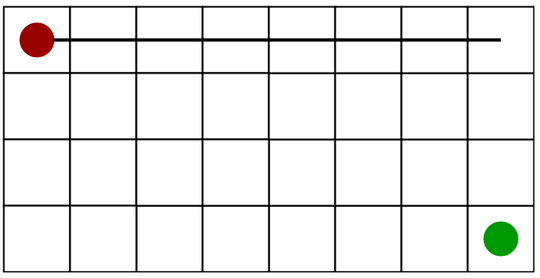

[1] Diagonal Distance Diagram

### Implementing Manhattan Distance Heuristics
First, I modified the geeksforgeeks code to only allow 4 directions of movement. Then I implemented Manhattan distance heuristics by replacing the H value function.

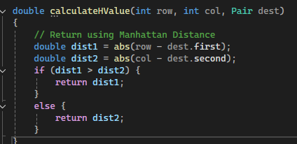

The result remained the same as before:

## Creating my own A* Algorithm
I found a useful Youtube video describing the A* Algorithm. I used the code as a starting point for my project. The code was in C# so I converted it to C++ with some help from Claude[3]. 

### Grid Display
First I wanted to created a function to display the grid. The grid is a vector of integer vectors.

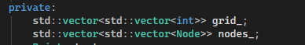

The final function to display the grid:

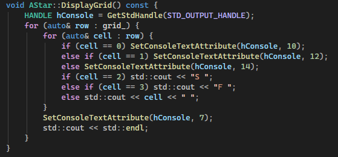

The function loops through the grid and prints characters depending on the value in the grid.
0's represent walkable space.
1's represent obstacles.
2 represents the start.
3 represents the destination/finish.

`SetConsoleTextAttribute` is used to change the colour of the characters to make the grid easier to read. This is a windows specific library. Googles C++ Style Guidelines [4] recommend avoiding platform specific functions so this is something I would like to change in the future, however, it serves its purpose well for this project.

### Grid Creation
Next I created a function to fill the grid. The starting code used a hardcoded grid with set start and end points. I replaced this with a simple random grid.

Below is the final `RandomiseGrid()` Function. I original used `time.h` and `rand` to generate the random numbers. I later changed this to use modern C++ libraries in order to follow Googles C++ guidelines [4]. `chrono` is now used to provide a random seed. This gives the number of seconds that have elapsed since the Unix epoch(Jan 1st 1970). 

The C++ `random` library function `mt19937` (Mersenne Twister) is then used to generate the random distribution using `uniform_int_distribution`.

I also implemented a simple way to ensure that there is always a valid path from the start to the destination. This provided a simple grid I used for testing and developing the A* algorithm.

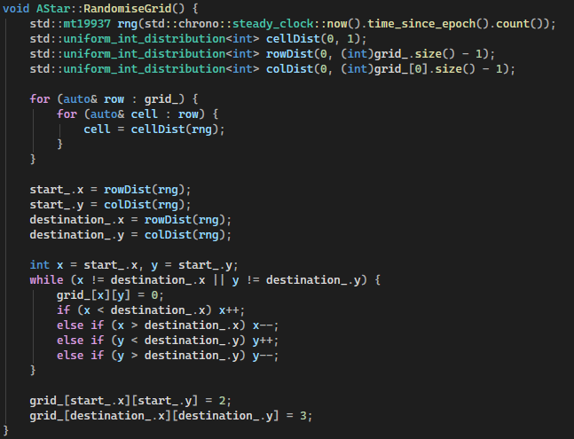

### Noise Based Grid Generation
#### Perlin Noise
To improve the random grid generation, I wanted to implement some form of noise. I've seen this used for procedural terrain generation in games.

I did some research on terrain generation using noise. Perlin noise is often used for this [5]. Perlin noise is a type of gradient noise used to generate smooth, natural-looking randomness. Instead of completely random values, it produces values that change gradually over space, which makes it ideal for things like terrain, clouds, or textures.

It works by assigning pseudo-random gradient vectors to points on a grid and then interpolating between them. The result is a continuous, coherent pattern where nearby points have similar values. Compared to pure random values it creates a more coherent and smooth randomness.

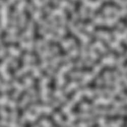

[5] Example of Perlin Noise.

To implement Noise into my grid generation, I used ChatGPT[7] to find a suitable C++ library:
FastNoiseLite was a nice library which fitted my requirements [8].

Below is the final `RandomiseGridPerlinNoise` function. Similar to the `RandomiseGrid` function it uses `chrono` as a random seed for the noise. the start and destination are also generated with `random`.

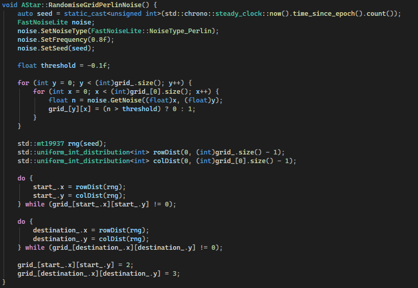

The key parameters to adjust the resultant grid are the frequency and the threshold values.

**Frequency:**  
Controls the spatial scale of the Perlin noise. Higher values (e.g. `0.8f`) increase the rate of change between adjacent samples, producing high-frequency variation (noisier, fragmented obstacles). Lower values produce smoother, larger contiguous regions, resulting in broader open areas and more coherent obstacle clusters.

**Threshold:**  
Defines the cutoff used to turn the continues noise values into a binary grid. Since `GetNoise()` returns values in `[-1, 1]`, the threshold changes the obstacle density:

Higher threshold results in fewer cells being above the threshold noise level, resulting in more obstacles and fewer walkable cells.

Together, frequency controls structure, while threshold controls density.

Resultant Grid with Perlin Noise:

Low Frequency:

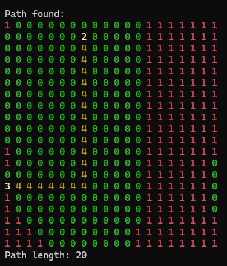

High Frequency:

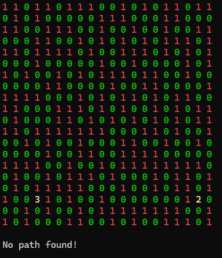

#### Worley Noise
Once I had basic noise implemented I wanted to find a more suitable form of noise. I checked all the noise types that FastNoiseLite supported. The key characteristic I wanted was a maze or corridor like shape where long thin paths form with large obstacles. Worley Noise fit this perfectly:

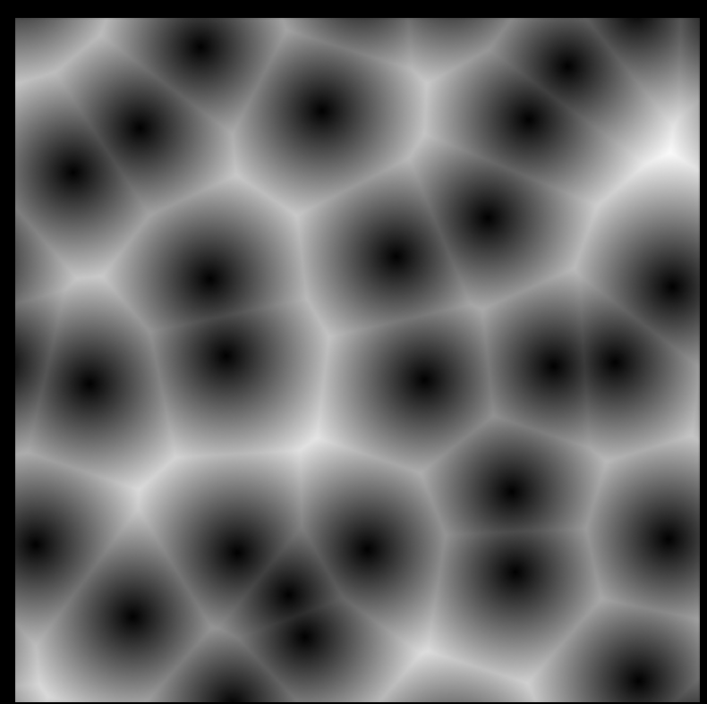

[9] Worley Noise Example

I made a copy of the `RandomiseGridPerlinNoise` Function and replaced the Perlin noise with Worley Noise:

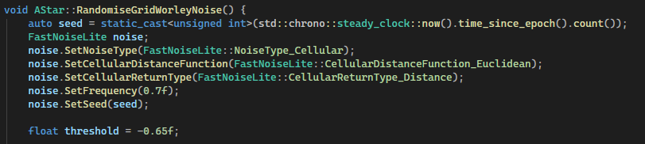

I tried many different frequency and threshold combinations. I found that a frequency of 0.7 and a threshold of -0.65 worked well and had a nice balance of obstacles and path complexity.
The resultant grid:

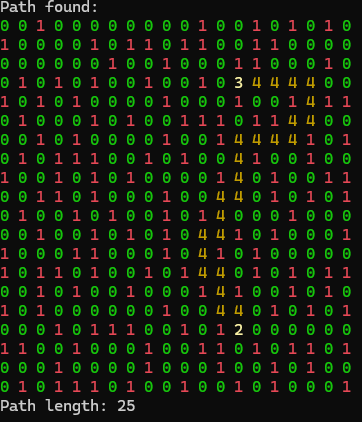

### Algorithm logic
After my initial research, I started by drawing a basic UML class diagram. The goal was to have a starting point with only the most essential functions and variables.

Below is my first UML class diagram

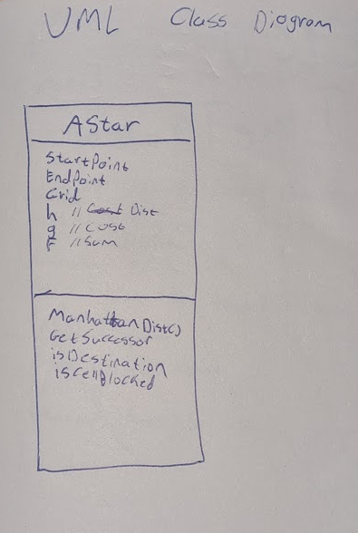

The first thing I implemented was the point struct. This is used to represent coordinates on the grid. Each node stores its `Point` so the algorithm can calculate distances, define start and finish locations, and determine neighbours. This makes A* pathfinding easier to implement and more readable, since every node knows exactly where it is in the grid space.

Point Struct:

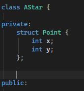

I also implemented the start and destination variables as private data members. These are set by the `RandomiseGrid` functions.

Start and destination:

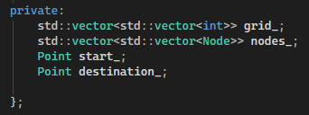

### Constructors
I created 3 constructors for the `AStar` class.

`AStar(int rows, int cols);` Initialises the class with a grid of rows x columns

`AStar(const AStar& other);` Creates a deep copy of an existing `AStar` class. This creates a full copy of the class and data, not just it's address.

`AStar(const std::vector<std::vector<int>>& user_grid);` Creates an `AStar` instance with a user defined grid

### Core Logic
The core logic is in the `FindPath` function. It implements the A* pathfinding algorithm by maintaining an open set (`toSearch`) of nodes to explore and a closed set (`processed`) of nodes that have already been evaluated. Each node keeps track of its cost from the start (`g`) and its heuristic estimate to the target (`h`), with the total estimated cost computed as `f = g + h`. At each iteration, the algorithm selects the node from `toSearch` with the lowest `f` value, breaking ties by choosing the node with a smaller `h`. The selected node is then marked as processed and removed from the open set. For each neighbour of the current node, the function calculates the tentative `g` cost and, if it improves the neighbour's current `g`, updates the neighbour's cost and records the path in `cameFrom`. Neighbours not yet in the open set are added and their heuristic `h` is computed. Once the target node is reached, the function reconstructs the path by backtracking through `cameFrom` from the target to the start. If no path is found, the function returns an empty vector, ensuring that the algorithm handles both reachable and unreachable targets efficiently.

This `FindPath` function is quite large and handles many responsibilities at once it's responsible for selecting the next node, updating neighbours, managing open and closed sets, and reconstructing the path. According to Google's C++ Style Guide, functions should be short, focused, and easy to read. In future improvements, this function could be broken into smaller helper functions, such as `SelectLowestFNode`, `UpdateNeighbor`, and `ReconstructPath`, to make the code more maintainable, testable, and easier to understand.

The `FindPath` function:

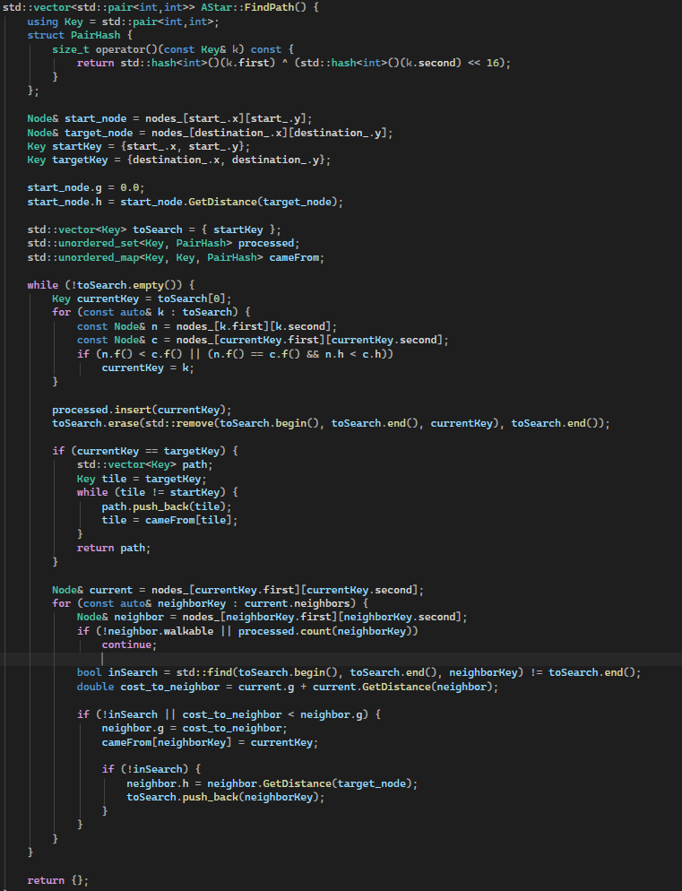

# Testing the Algorithm
To finish the project, I added a `test.h` and `test.cpp` file. For most applications, unit testing is preferred. Unit testing confirms that logic of every function gives the correct output and handles incorrect arguments gracefully. For this project, unit testing is out of scope so I testing the application as a whole. Ensuring the pathfinding works as intended and cases where no valid path exists is handled correctly. This approach also keeps `main.c` clean, inline with Googles C++ guidelines. 

Below is an example test functions. This function uses the Worley Noise grid. An `AStar` object is created and the grid is randomised. Next, the nodes are initialized and the algorithm is run. Finally, a check is done to test if a path was found and then the result is displayed. The other grid variations are tested the same way.

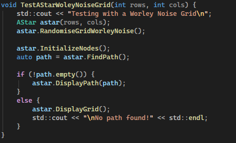

Below is the `RunTests` function that gets called from main. The function runs all the test functions and also allows the user to press 'R' to rerun the tests. This is especially useful due to the random grid generation making each run have a unique grid and unique start and end locations.

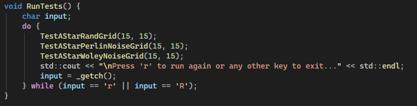

To improve this in the future, I would like to add more test cases including:
- Checking for invalid grid sizes, e.g., -5, 0 etc.
- Testing extremely large grids.
- Testing invalid start and destination points being set manually.

The ultimate goal would be to create unit tests for every function and test every possible configuration and failure mode. This would bring the code inline with Googles C++ guidelines.

# Final Polish

To finalize the project, I reviewed the Google C++ Style Guide and used Claude to highlight potential improvements. I specifically focused on:

- **Modern C++ random generation:** Replacing `rand()` and `srand()` with `std::mt19937` seeded via `std::chrono::steady_clock` for all grid randomization.
- **Type-safe casting:** Replacing all C-style casts (e.g., `(float)x`) with `static_cast<float>(x)` in noise calculations.
- **Private member naming:** Using trailing underscores (`grid_`, `nodes_`, `start_`, `destination_`) for all private class members.
- **Function naming:** Following PascalCase for all public methods, such as `RandomiseGrid()` and `DisplayPath()`.
- **Const correctness:** Marking methods that do not modify object state as `const`, including `DisplayGrid()`, `DisplayPath()`, and `CalculateHValue()`.
- **Pointer elimination:** Using references and values instead of raw pointers or `nullptr`s for all `Node` objects and path calculations, improving safety and readability.

## Future Improvements

Looking ahead, there are a few areas I could improve in future versions of this project. Currently, grid cell values like `0, 1, 2, 3, 4` are hardcoded. Using named constants or an `enum class` would make the code more readable and maintainable, which is strongly recommended in Google's C++ style guide.

Right now, the `Node` struct exposes all its fields publicly. Encapsulating them with private members and providing getters/setters would improve encapsulation and follow Google's guideline on data hiding.

In `FindPath()`, `std::find()` is used inside loops to check `toSearch`. Replacing this with `std::unordered_set` or another O(1) lookup structure would improve efficiency and follows Google's recommendation for writing efficient, clear algorithms.

# Project Planning
I used Obsidian to keep track of the work I completed and to save screenshots and notes to document my progress. I kept track the sources used throughout the project including the date accessed. This made writing the final report much easier. 

I also wrote down things I would like to complete over the coming week. I treated each week like a mini sprint focusing on what I completed the previous week and what I want to complete in the current week. This ensured steady progress throughout the project.

I made sure to keep the code as modular as possible throughout development. This made it easy to incrementally improve the project without having to refactor a significant amount of code. A good example of this is the random grid generation. I created several methods of creating the grid as the project went on. With the modular design, I could simply call a different function to change how the grid was generated without having to consider any other aspect of the code.

One aspect I could improve in is function and variable naming. I consistently used camel case throughout the project but there where small inconsistencies such as using upper and lower case letters at the beginning of names. I also sometimes omitted trailing underscored in private data members. At the end of the project I went through the entire codebase and tidied up all names.

# Reflection
This project helped me use and understand the best practices for C++. I also learned how the A* algorithm works. Throughout the project, I continuedly improved the logic and readability of the code and followed Googles C++ style guide as closely as I could. At the start of the project, I was still in the habit of writing C style code, using raw pointers and basic for loops to solve problems. Through working on this project I became comfortable with using modern C++ and taking advantage of it's features. I also enjoyed working on the noise based grid generation. This is something I would like to dive into more detail on in the future. Overall, I'm happy with how the project turned out and I am already thinking of ways of improving it in the future.

# Sources
[1] [A* Search Algorithm - GeeksforGeeks](https://www.geeksforgeeks.org/dsa/a-search-algorithm/) 04/02/26 "example code and algorithm explanation and heuristics graphs"

[2] https://www.youtube.com/watch?v=i0x5fj4PqP4 06/02/26 "Reference code"

[3] https://claude.ai 04/02/26 "Code assistance and general research"

[4] https://google.github.io/styleguide/cppguide.html 29/02/26 "C++ style guidelines"

[5] [Procedural 2D Generation Using Noise Function - Medium](https://medium.com/@versydev/procedural-2d-generation-using-noise-function-python-02d23d8cf7af) Jan 2026 "Noise for 2D procedural generation."

[6] https://en.wikipedia.org/wiki/Perlin_noise 20/03/26 "Perlin Noise details"

[7] https://chatgpt.com/ 04/02/26 "General research"

[8] https://github.com/Auburn/FastNoiseLite "Noise generation library"

[9] https://docs.blender.org/manual/en/4.0/render/shader_nodes/textures/voronoi.html "Worley Noise Image"
